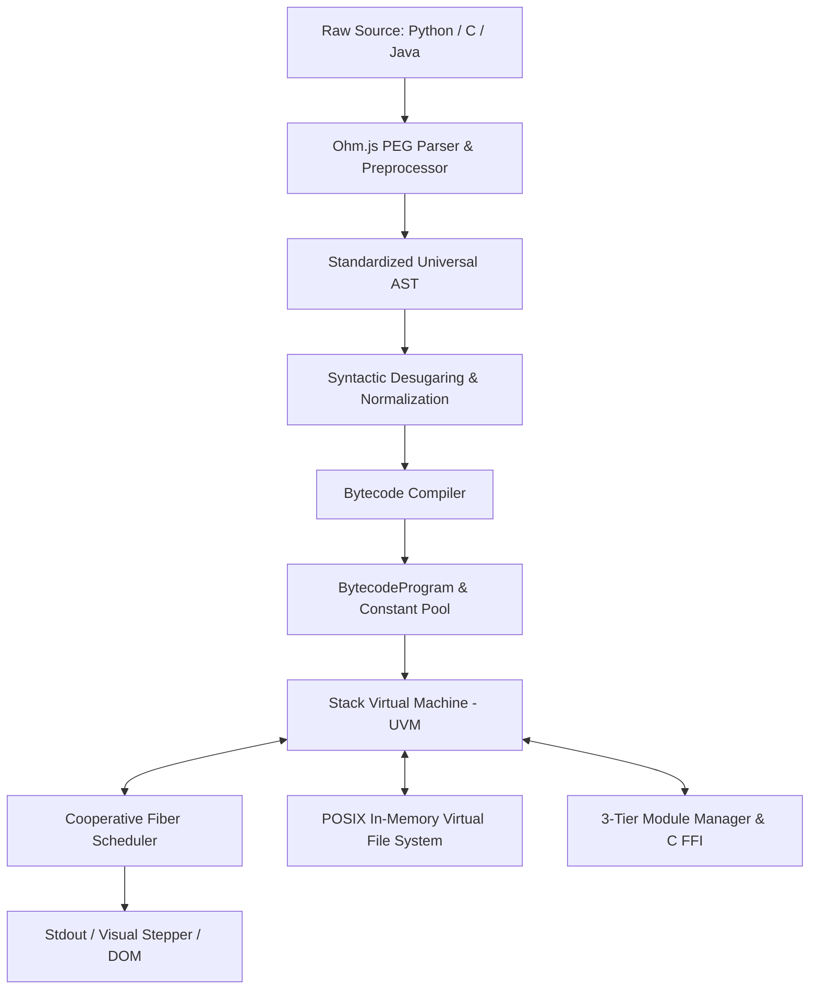

# UVM Studio — Bytecode Virtual Machine & Stepper

[](#-testing)
[](#-highlights)
[](#-highlights)
[](#-license)

A lightweight, browser-native bytecode virtual machine, compiler, and Python subset runtime written in pure JavaScript. Featuring cooperative multitasking fibers, an in-memory POSIX Virtual File System (VFS), simulated C-extensions, and visual opcode step-debugging.

> 🚀 **Live Demo**: Explore the interactive Monaco Web IDE, visual bytecode stepper, and live ASCII terminal at **[ab-613.github.io/uvm.js](https://ab-613.github.io/uvm.js/)**!

---

## 🌟 Highlights

- **Zero Heavy WebAssembly**: Pure JavaScript runtime under **250 KB minified** (unlike 25MB+ WebAssembly runtimes like Pyodide). Instant startup in any browser or WebView.
- **Cooperative Fiber Scheduler**: ES6 Generator-driven multitasking (`function*` / `yield`) allowing non-blocking `time.sleep()`, interactive `input()` prompts, and multi-thread interleaving without locking the UI event loop.
- **Visual Bytecode Stepper**: Step instruction-by-instruction through compiled opcodes, inspecting call stack frames, operand stacks, local variables, and memory in real time.
- **In-Memory POSIX VFS**: Complete virtual filesystem with support for standard Python `with open(...) as f:` context managers, directory traversal, and dynamic file manipulation.
- **3-Tier Module Architecture**:
  - *Tier 1 (VFS Standard Library)*: Pure Python modules loaded and dynamically compiled from virtual disk (`/lib/python3/`).
  - *Tier 2 (Simulated C Extensions)*: C extension functions compiled directly to UVM bytecode sharing native stack frames.
  - *Tier 3 (Host Bridges)*: Native host bridges for `math`, `random`, `json`, `re`, and async `requests`.
- **Clean PEG Grammars**: Extensible Parsing Expression Grammars powered by Ohm.js with indentation preprocessing and helpful syntax diagnostics.

---

## 🌐 Quick Browser Usage (`<script src>`)

You can embed UVM directly in any webpage with **zero build steps, zero bundlers, and zero import maps**:

```html
<!DOCTYPE html>
<html>
<head>
  <!-- 1. Include the standalone bundle via jsDelivr CDN -->
  <script src="https://cdn.jsdelivr.net/npm/uvm-js/dist/uvm.min.js"></script>
</head>
<body>
  <script>
    // 2. Instantiate and run Python immediately
    const uvm = new UniversalInterpreter();

    uvm.run(`
def fib(n):
    return n if n <= 1 else fib(n - 1) + fib(n - 2)

for i in range(7):
    print(f"fib({i}) = {fib(i)}")
    `).then(res => {
      console.log(res.output);
    });
  </script>
</body>
</html>
```

For a complete working UI example, inspect [`examples/standalone_browser.html`](examples/standalone_browser.html).

---

## 🚀 Getting Started

### 1. Run Locally (Web IDE & Stepper)

```bash
# Clone the repository
git clone https://github.com/ab-613/uvm.js.git
cd uvm.js

# Install dependencies (Ohm.js)
npm install

# Start the local development server
npm start
```

Navigate to `http://localhost:3000` to launch the Monaco-based IDE with real-time bytecode disassembly, VFS explorer, and debugger.

---

### 2. High-Level JavaScript / Node.js SDK

```javascript
import { UniversalInterpreter } from 'universal-interpreter';

const uvm = new UniversalInterpreter();

// 1. Asynchronous Execution (with cooperative fiber scheduling)
const result = await uvm.run(`
x = [i * 2 for i in range(5)]
print(f"Calculated evens: {x}")
`, { language: 'python' });

console.log(result.output); // "Calculated evens: [0,2,4,6,8]\n"

// 2. Synchronous Execution (fast-path for simple non-yielding scripts)
const syncResult = uvm.runSync('print(2 ** 16)', { language: 'python' });
console.log(syncResult.output); // "65536\n"
```

---

### 3. Command Line Interface (CLI)

Run scripts from your terminal:

```bash
# Run a Python script
npm run cli -- run script.py

# Disassemble bytecode instructions
npm run cli -- dis script.py

# Evaluate an inline code snippet
npm run cli -- -e "print([x for x in range(10) if x % 2 == 0])" -l python

# Launch the interactive REPL
npm run cli -- repl -l python
```

---

### 4. Low-Level VM & Compiler Access

For building compilers, custom syscalls, or inspecting internal bytecode:

```javascript
import {
  parseSource,
  BytecodeCompiler,
  VirtualMachine,
  Scheduler,
  vfs,
  moduleManager,
  OP
} from 'universal-interpreter';

// Step 1: Parse source code to standardized AST
const ast = parseSource('x = 42\nprint(x)', 'python');

// Step 2: Compile AST to bytecode instructions
const compiler = new BytecodeCompiler();
const program = compiler.compile(ast);
console.log(program.disassemble());

// Step 3: Execute on stack VM with cooperative scheduler
const vm = new VirtualMachine({ moduleManager, vfs });
const scheduler = new Scheduler(vm);
scheduler.spawn(vm.execute(program));

scheduler.run(() => {
  console.log('Execution finished!');
});
```

---

## 🎯 Language Coverage & Scope

UVM is designed as a **fast, lightweight micro-runtime, sandbox, and educational virtual machine**, not a 1:1 replacement for the 50MB CPython binary distribution:

| Feature Area | Status | Details |
| :--- | :--- | :--- |
| **Python Syntax & Core** | **Supported** | Functions, recursion, closures/upvalues, classes, single inheritance, `try/except/finally`, list/dict/set comprehensions, slicing, f-strings, `*args`, `**kwargs`. |
| **Cooperative Multitasking** | **Supported** | Fiber scheduler using ES6 generators (`yield`), non-blocking `time.sleep()`, interactive `input()`. |
| **Filesystem (VFS)** | **Supported** | In-memory POSIX tree, `with open(...) as f:`, read, write, seek. |
| **Standard Library** | **Supported** | `math`, `random`, `json`, `re`, `statistics`, `colorsys`, async `requests`. |
| **C Extensions (Tier 2)** | **Experimental** | Compiles ANSI C functions to UVM bytecode sharing native stack frames. |
| **Java Profile** | **Syntax Preview**| PEG grammar preview demonstrating Java class, method, and loop parsing. |
| **Full CPython Binaries**| *Out of Scope* | Heavy C-extensions like NumPy/Pandas require WebAssembly/Pyodide. |

---

## 🧪 Testing & Verification

UVM includes a comprehensive automated test suite covering frontend parsing, desugaring, compiler slot allocation, VM opcode execution, generator fibers, VFS, and adversarial fuzzing:

```bash
# Run all 17 test suites
npm test
```

All 17 suites pass with 100% reliability.

---

## 🏛️ Architecture Overview



---

## 📦 Building Standalone Distributions

To regenerate the standalone browser and minified distributions:

```bash
npm run build
```

Build outputs:
- `dist/uvm.bundle.js` — Standalone unminified browser distribution with sourcemaps.
- `dist/uvm.min.js` — Minified standalone browser bundle (~247 KB).
- `dist/uvm.mjs` — Standalone ESM distribution for modern module workflows.

---

## 📄 License

MIT License. Free for educational, commercial, and open-source use.
