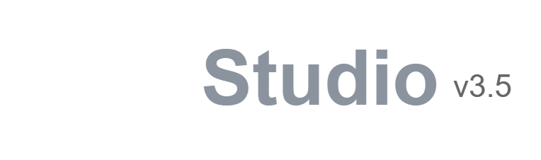

<p align="center">
  
</p>

<p align="center">
  A bytecode compiler and stack-based virtual machine for Python 3, written from scratch in pure JavaScript.
  <br>
  <strong>Runs in the browser under 250 KB with zero WebAssembly.</strong>
</p>

<p align="center">
  <a href="https://ab-613.github.io/uvm.js/"><strong>Open Live Web Studio & Stepper →</strong></a>
</p>

<p align="center">
  <a href="https://ab-613.github.io/uvm.js/">
    <kbd></kbd>
  </a>
</p>

*(Monaco editor, live-pulsing AST tree, bytecode table, and VM stack/memory inspector)*

---

## What this is (and what it isn't)

This is **not** Pyodide, Skulpt, or a complete CPython replacement. It cannot run NumPy, Pandas, or complex Python packages. 

It is an educational sandbox and micro-runtime built to explore how much of the Python developer experience can be replicated in a lightweight, pure-JS engine without loading a 30MB WebAssembly binary.

If you need a real, compliant Python runtime in the browser, use **Pyodide**. If you want an instant-booting interactive bytecode stepper or a lightweight playground for docs, this is for that.

---

## How it works (and the shortcuts taken)

Because the goal was a micro-VM under 250 KB, several language features are deliberately desugared into simpler primitives rather than implementing full CPython semantics:

### 1. Generator-Based Dispatch (`js/vm/vm.js`)
Instead of a `while(true)` dispatch loop, the VM's execution loop is an ES6 generator (`function* executeLoop()`). 

Yielding per instruction solves three hard browser problems in one place:
- **`time.sleep(ms)`**: Yields a sleep token to a cooperative scheduler (`Scheduler.js`), which resumes the generator via `setTimeout` without locking the UI thread.
- **`input()`**: Suspends the generator until the user submits text from the DOM.
- **Single-step debugging**: Stepping in the UI is literally just calling `.next()` on the generator and reading `vm.operandStack`.

### 2. Layout Preprocessing & AST Desugaring (`js/frontend/`)
Ohm.js is a PEG parser, which doesn't natively handle Python's off-side indentation. 
- `python_preprocessor.js` first scans whitespace, balances brackets, and emits explicit `{}` delimiters before the grammar sees it.
- **For-loop shortcut**: To avoid the complexity of full generator/iterator protocol machinery (`__iter__` / `__next__`), `for` loops currently desugar into indexed `while` loops tracking `len(seq)` and `seq[i]`. Iterables must support indexing.
- **Context managers**: `with open(...) as f:` desugars directly into a `try/finally` block invoking `__enter__()` and `__exit__()`.
- **Comprehensions**: Desugar into immediate-invoked function expressions with an internal accumulator list.

### 3. In-Memory POSIX VFS & Terminal Buffer
- Includes an in-memory virtual file system (`/workspace/`, `/lib/`) wired into Python's `open()` builtin.
- Output is managed by a virtual 2D line buffer (`terminal.js`) supporting carriage returns (`\r`) and ANSI screen clearing (`\x1b[2J`), allowing in-place progress bars and ASCII frame rendering.

### 4. Limited Stdlib & Remote Fetching
The VM includes pure JS host bridges for basic utilities (`math`, `time`, `json`, `re`, and async `requests` via browser `fetch`), and ANSI terminal buffer supporting `\r` (in-place progress bars) and `\x1b[2J` (screen clearing for ASCII animations - see the "starwars" demo on the site).

For self-contained, pure-Python modules (like colorsys, calendar, heapq, bisect, or single-file PyPI packages like cowsay), the module manager dynamically fetches the .py source from the CPython 3.12 GitHub branch and caches it in the in-memory VFS. **This only works for self-contained, pure-Python modules.** Standard modules that depend on low-level OS syscalls or un-shimmed CPython C internals will fail.

### 5. Toy C-to-Bytecode Parser (`js/vm/c_extension.js`)
This is **not** a general C compiler or WASM virtualization layer. It is a small demonstration parser that recognizes single-file C functions adhering to `Python.h` conventions (`PyMethodDef` and `PyArg_ParseTuple`). It strips the Python argument wrapper and compiles basic arithmetic loops (like Euclid's GCD) directly into UVM bytecode instructions so C and Python functions share the exact same call frames and operand stack.

---

## Language Coverage & Compromises

| Feature | Supported? | Implementation Reality |
| :--- | :--- | :--- |
| **Arithmetic & Logic** | Yes | Basic operators, bitwise, floored integer division `//`, chained comparisons. |
| **Functions & Closures** | Yes | Frame-based local slots, lexical upvalues, `*args`, default arguments. |
| **For Loops** | Pragmatic subset | Desugars to indexed `while` loops over `len()`. Does not support arbitrary `__iter__` objects. |
| **Classes & OOP** | Pragmatic | Single inheritance, method binding, constructors, `super()`, and `@property` / decorators. |
| **Exceptions** | Yes | `try / except / else / finally / raise`. Safe stack unwinding. |
| **Async / Multitasking** | Yes | Generator-backed cooperative fibers (`sleep`, `input`). |
| **C Extensions** | Toy demo | Compiles simple math loops matching `PyMethodDef` syntax into UVM bytecode. No pointers or `libc`. |
| **Binary Wheels (NumPy, etc.)** | No | Out of scope. Impossible without full container/WASM runtime. |

---

## Quickstart

```bash
npm install uvm-js
```

```javascript
import { UniversalInterpreter, VirtualMachine } from 'uvm-js';

const uvm = new UniversalInterpreter();

// 1. Run Python code asynchronously
const res = await uvm.run(`
def fib(n):
    return n if n <= 1 else fib(n - 1) + fib(n - 2)

for i in range(7):
    print(f"fib({i}) = {fib(i)}")
`);

console.log(res.output);

// 2. Single-step bytecode execution
const program = uvm.compile('x = 10 + 20\nprint(x)');
const vm = new VirtualMachine();
const stepper = vm.execute(program, true); // true = singleStepMode

let step = stepper.next();
while (!step.done) {
  console.log(`PC: ${vm.pc} | Stack:`, vm.operandStack);
  step = stepper.next();
}
```

## License

MIT
