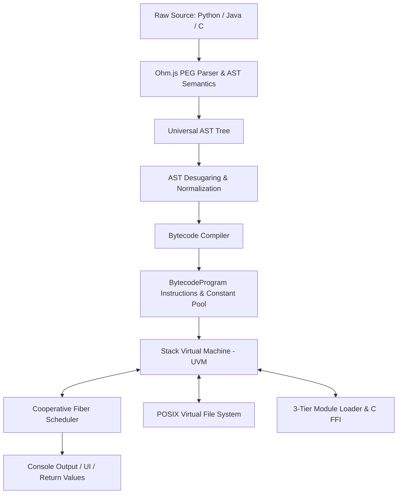

# Codebase Architecture: Universal Virtual Machine (UVM 3.5)

This document provides a comprehensive technical overview of the architecture, design patterns, and execution pipeline of the **Universal Virtual Machine (UVM)** engine.

---

## 1. High-Level System Architecture

The Universal Interpreter compiles and executes high-level languages (Python 3, Java, and ANSI C) on a unified stack-based virtual machine:

---

## 2. Component Breakdown

### 2.1 PEG Frontend & AST Semantics (`js/frontend/`)
Instead of fragile hand-rolled regular expression tokenizers, parsing is handled using **Ohm.js** PEG (Parsing Expression Grammar) definitions:
* **Grammars**: [`python_grammar.js`](js/frontend/python_grammar.js), [`java_grammar.js`](js/frontend/java_grammar.js), and [`c_grammar.js`](js/frontend/c_grammar.js) inherit from [`base_grammar.js`](js/frontend/base_grammar.js).
* **Python Preprocessing**: [`python_preprocessor.js`](js/frontend/python_preprocessor.js) handles layout-sensitive indentation, balancing and generating explicit block tokens.
* **AST Desugaring**: [`python_semantics.js`](js/frontend/python_semantics.js) desugars complex syntax into clean primitive AST nodes (e.g. list/dict comprehensions to while loops, f-strings to string concatenations, tuple unpacking).

### 2.2 Bytecode Compiler (`js/vm/compiler.js`)
The `BytecodeCompiler` converts high-level AST trees into compact bytecode instructions:
* **Slot Allocation**: Scopes are analyzed to assign local variables to stack frame slots (`LOAD_LOCAL`, `STORE_LOCAL`).
* **Lexical Scoping & Upvalues**: Tracks closures across function boundaries (`LOAD_UPVALUE`, `STORE_UPVALUE`).
* **Jump Backpatching**: Handles control flow for `while`, `for`, `if/else`, `break`, and `continue` by tracking instruction addresses and backpatching branch targets.
* **Exception Frames**: Emits `PUSH_TRY` and `POP_TRY` blocks with target catch and finally program counters.

### 2.3 Universal Virtual Machine (`js/vm/vm.js`)
The VM executes bytecode on a call-stack and operand-stack model:
* **ES6 Generator Architecture**: `VirtualMachine.prototype.execute` is implemented as an ES6 generator (`function*`). This yields execution slices to prevent blocking the host event loop.
* **Exception Stack Unwinding**: Traps runtime exceptions and safely unwinds call frames to the nearest active `try` handler.
* **Type Solving & Method Dispatch**: Built-in methods for strings, lists, dictionaries, and math operations execute directly within the VM.

### 2.4 Cooperative Fiber Scheduler (`js/vm/scheduler.js`)
Manages non-blocking concurrent fibers:
* Implements cooperative time-slicing (16ms per frame).
* Handles non-blocking `sleep(ms)` (`SYS_SLEEP`), interactive user input prompts (`SYS_INPUT`), and fiber joining.
* Provides thread isolation: an unhandled exception in a background fiber logs an error without crashing adjacent fibers.

### 2.5 In-Memory Virtual Filesystem (`js/vfs/vfs.js`)
* Provides an in-memory POSIX file system (`/lib/`, `/tmp/`).
* Directly integrated into Python's `open()` context manager (`with open(...) as f:`), allowing scripts to write, read, and delete files in browser memory.

### 2.6 3-Tier Module Architecture (`js/vm/modules.js`)
* **Tier 1 (VFS Pure Python)**: Reads `.py` files from `/lib/python3/` and compiles them dynamically to bytecode.
* **Tier 2 (C Extensions)**: Loads `.c` files from `/lib/c/`, compiles C functions via [`c_extension.js`](js/vm/c_extension.js) into bytecode, sharing the exact same VM stack frames and memory.
* **Tier 3 (Host Bridges)**: High-speed bridges for native host engines (`math`, `random`, `json`, `re`).

---

## 3. Public API & Interfaces

* **Main SDK Entrypoint**: [`js/index.js`](js/index.js) (`UniversalInterpreter`).
* **CLI Utility**: [`bin/uvm.js`](bin/uvm.js) (`npx uvm run`, `npx uvm repl`, `npx uvm dis`).
* **Web IDE**: [`index.html`](index.html) powered by [`js/main.js`](js/main.js) and Monaco Editor.
